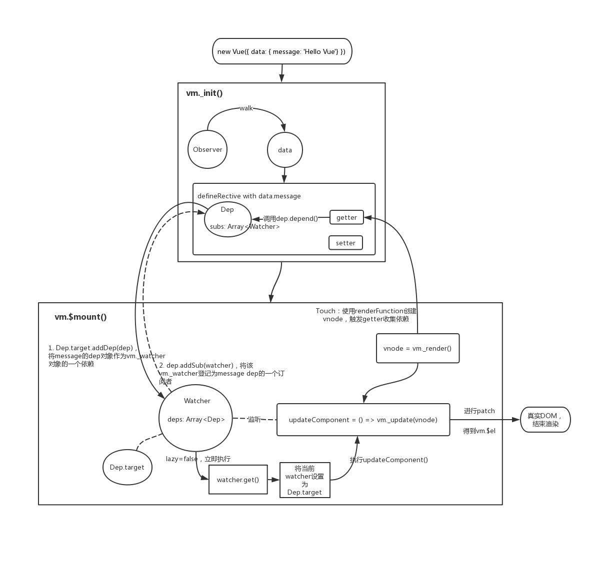
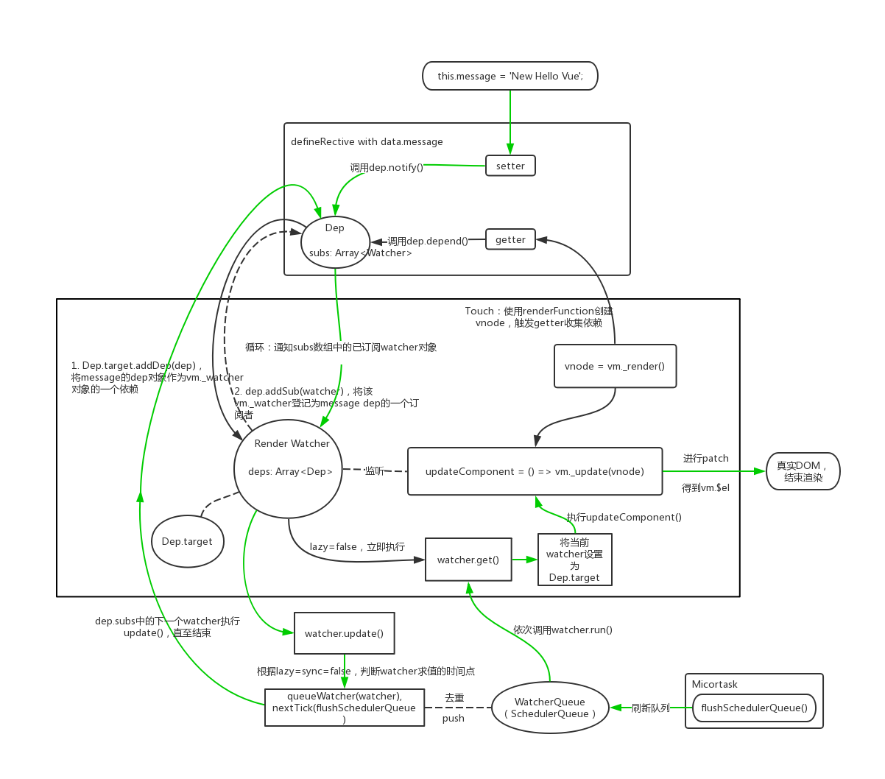

# 老菜鸟分析 Vue 的观察-订阅模式：数据变化之后是如何更新页面的呢？

假设 Vue 已经完成了页面初始渲染处于状态 A，现在进行了某些操作，调用了 `changeMessage` 方法，执行了 `this.message = 'New Hello Vue';` 语句，对 `message` 属性重新赋值了。那么接来，Vue 究竟会做些什么来让我们在页面上看到最新的 `New Hello Vue` 结果呢？下面将详细分析并附上流程渣图。

场景如下：

```javascript
const app = new Vue({
  data: {
    message: 'Hello Vue'
  },
  methods: {
    changeMessage() {
      this.message = 'New Hello Vue';
    }
  }
});

app.$mount('#app');
```

```html
<div class="app-container">
  <p>{{message}}</p>
</div>
```

## Vue 的观察-订阅模式

为了更好的讲解 `this.message = 'New Hello Vue'` 背后 Vue 究竟做了些什么这个问题，先来讲讲状态 A 是来的。这就涉及 Vue 中的观察-订阅模式。

Vue 的观察-订阅模式由 3 部分组成：

- Observer，为数据对象、计算属性对象创建响应式的 getter、 setter；
- Watcher，监控某个值或者表达式，当满足某些条件时，执行 `watcher.get()` 或者 `watcher.run()` 对表达式进行求值；
- Dep，处理依赖关系：收集依赖和通知变化；

Dep 处理依赖的行为：

- 类属性 `Dep.target`，表示当前正在执行 `get()` 方法求值的watcher对象；
- `subs` 属性用于存放登记为订阅者的 watcher 对象；
- 在 getter 触发时收集依赖 `depend()` ：将自身这个 dep 实例 push 到当前正在求值的 watcher 对象的 `watcher.deps` 数组中（ `Dep.target.addDep()` ），表示将该 dep 作为 wathcer 对象的一个依赖；同时也将当前求值的 watcher 对象 push 到 `dep.subs` 数组中，表示将 watcher 对象登记为 dep 的一个订阅者；
- 在 setter 触发时通知变化 `notify()` ：会通知 `subs` 数组中所有已经订阅的 watcher 对象， watcher 会执行 `update()` 方法，一般情况下（无指定 lazy、 sync ），watcher 不会立即进行求值，而是被添加到一个队列中，并通过标识位 `flushing`、`waiting` 来控制队列的执行。（对应源码 `src/core/observer/index.js 行191`、`src/core/observer/dep.js 行37`、`src/core/observer/watcher.js 行164`、`src/core/observer/scheduler.js 行164` ）

## 从 `new Vue` 到达状态 A

在 `new Vue` 创建实例的时候，会对参数中的 data 部分进行一个改造：（对应源码 `src/core/instance/state.js 行112`、`src/core/observer/index.js 行37, 110, 135`）

1. 为数据 data 对象创建一个 Observer 对象的实例，通过 `data.__ob__` 进行引用；
2. observer 对象中包含一个 Dep 对象实例 `dep`；
3. `walk` 遍历 data 对象的所有属性，使用 `defineProperty` 为每个属性创建响应式的 getter 和 setter，每一个属性都具有各自的 `dep` 实例用于处理依赖关系；

当将 vue 实例对象挂载到目标 DOM 上，实际会执行 `mountComponent()` 方法，创建一个 watcher 对象用来监听该 vm 的 `updateComponent` 方法：（对应源码 `src/core/instance/lifecycle.js 行141, 197`、`src/core/observer/watcher.js 行93, 102`）

1. 定义一个 `updateComponent = () => vm._update(vm._render(), hydrating)` 函数，表示更新组件的操作；
2. 创建一个 watcher 对象（ render watcher ），并监听 `updateComponent` 函数；因为 lazy 默认为 false，所以会立即执行 `watcher.get()` ：将 `Dep.target` 设置为当前的 watcher 对象，对 `updateComponent` 函数求值，即立即调用 `updateComonent()`；
3. `vm_render()` 中通过预编译或者运行时编译得到的 render function，创建对应的 vnode，会触发数据对象中的属性 getter，参照上面的 **Dep 处理依赖的行为**；
4. `vm._update(vnode)` 中通过 render 得到的最新 vnode 去与 oldVnode 进行 patch 打补丁，得到最终实际的 DOM：`vm.$el = vm.__patch__(oldVnode, vnode)`；

经过上面的步骤之后，vue 已经完成了一次页面渲染并到达状态 A 。画个渣图来表示一下：



## 改变了数据，触发更新

`this.message = 'New Hello Vue'` 执行，会触发 message 的 setter，按照上面关于 Dep 的说明，则：

1. setter 中调用 `dep.notify()`，通知 `subs` 数组中的所有已订阅 watcher 对象依次执行 `update()` 方法；（对应源码 `src/core/observer/index.js 行173`、`src/core/observer/dep.js 行37`）
2. 根据创建 watcher 对象的参数 `lazy`、`sync` 来决定 watcher 对象求值的时间点，一般情况下，会执行 `queueWatcher()` 将当前 watcher 对象 push 到一个队列中；（对应源码 `src/core/observer/watcher.js 行164`）
3. 只要调用 `queueWatcher(watcher)` 方法，参数 watcher 对象就被 push 到队列中；如果存在多个数据被改动，则会有多个 watcher 会 push 到队列，而且相同的 watcher 对象只会被 push 一次（通过 watcher.id 区分，id 为自增唯一）。（对应源码 `src/core/observer/scheduler.js 行164`）
4. 但是 `queueWatcher` 方法并不会立即对队列中的所有 watcher 对象进行求值，而是执行 `nextTick(flushSchedulerQueue)`，意味着刷新 watcher 队列的操作会在当前 event loop 的 task 被执行完毕之后再执行（ `nextTick` 使用了 Micortask 队列）。所以 `queueWatcher` 方法执行完毕之后，回到第一步中的： dep 对象的 `subs` 数组中下一个 watcher 对象的 `update()` 被调用，直至所有 `subs`中的 watcher 都执行过 `update()`。

上面的 1~4 步骤为同步代码，处于同一个事件 tick 中。当前 Micortask 队列中的 `flushSchedulerQueue` 执行时：

1. `flushSchedulerQueue()` 方法会刷新队列，依次对 watcher 对象求值，通过调用 `watcher.run()` 来执行 `watcher.get()`；所以对于 render watcher 来讲，它的 `updateComponent()` 被调用，之后的过程就和执行 `$mount()` 方法那里讲的差不多。（对应源码 `src/core/observer/scheduler.js 行71`）

从上面分析来看，修改了数据之后，Vue 不会立即更新 DOM，而是将更新 DOM 的操作都放到 Micortask 队列中异步执行。所以才会有在数据变化之后等待 Vue 完成更新 DOM 的 `vm.nextTick()` 用法。

题外话： `nextTick(cb)` 方法中维护着一个 callback 队列，会按照调用 `nextTick()` 先后顺序依次将 callback push 到队列中，但是多次调用 `nextTick` 也只会增加一个 micortask ，所有 callback 都会在同一个 micortask 中被执行。

经过了上面的步骤之后，数据更新之后的DOM已经被重新渲染了。再画个渣图来表示一下：



## 小结

上面通过一个超简单的例子来分析了一下Vue的生命周期，所谓万变不离其中，复杂案例大体流程也是这样。  

个人认为，从原理理解上来讲，Vue 可以分为：

- 响应式数据的实现，观察-订阅模式
- VNode的创建、diff、patch

关于 render function 是怎么创建 vnode 的，以及 vnode 之间是如何 diff、patch 的，可以讲很长篇幅。  

这是老菜鸟写的第一篇技术文，希望各位大神多多指点、交流。